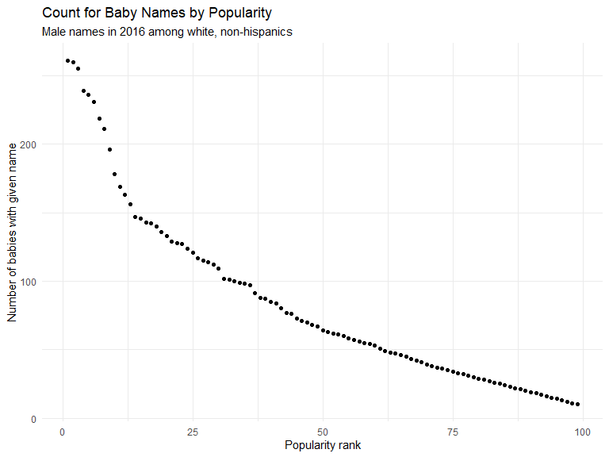

HW 2
================

## Problem 1

#### Mr. Trash Wheel data

``` r
# read in Mr. Trash Wheel data excluding the header and note column
df_trash_data = read_excel("Data/Trash-Wheel-Collection-Totals-8-6-19.xlsx",
                           sheet = "Mr. Trash Wheel",
                           range = cell_cols("A:N"),
                           skip = 1)

# clean names
df_trash_data = df_trash_data %>%
  janitor::clean_names()

# drop summary rows
df_trash_data = df_trash_data %>%
  drop_na(dumpster)

# round sports balls field and parse to numeric
df_trash_data = df_trash_data %>%
  mutate(
    sports_balls = round(sports_balls, 0) %>%
      as.integer()
  )
```

#### Precipitation data

``` r
# read in 2017 precipitation data
df_precipitation_17 = read_excel("Data/Trash-Wheel-Collection-Totals-8-6-19.xlsx",
                                 sheet = "2017 Precipitation",
                                 range = "A2:B14")

# clean names
df_precipitation_17 = df_precipitation_17 %>%
  janitor::clean_names()

# filter out missing values and add year feature
df_precipitation_17 = df_precipitation_17 %>%
  drop_na(total) %>%
  mutate(year = 2017)


# read in 2018 precipitation data
df_precipitation_18 = read_excel("Data/Trash-Wheel-Collection-Totals-8-6-19.xlsx",
                                 sheet = "2018 Precipitation",
                                 range = "A2:B14")

# clean names
df_precipitation_18 = df_precipitation_18 %>%
  janitor::clean_names()

# filter out missing values and add year feature
df_precipitation_18 = df_precipitation_18 %>%
  drop_na(total) %>%
  mutate(year = 2018)


# join the datasets together
df_precipitation = rbind(df_precipitation_17, df_precipitation_18)

# change month values to character names
df_precipitation = df_precipitation %>%
  mutate(
    month = month.name[month]
  ) %>%
  select(year, month, total_precipitation = total)
```

The `Mr. Trash Wheel` data comprise 14 columns and 344 observations. Key
features of this dataset include `weight_tons` and `volume_cubic_yards`,
the weight and volume, respectively, of trash collected per month. The
number of homes powered by incinerating the collected trash,
`homes_powered`, is also an interesting feature that demonstrates the
impact that Mr. Trash Wheel has on the Baltimore community. The dataset
also contains quantities of certain itemized trash objects, such as the
number of sports balls collected. In 2017 for example, the median number
of balls collected per dumpster was 8.

The precipitation data describe the total precipitation in Baltimore per
month. There are 24 observations, representing precipitation for all
months in 2017 and 2018. Notably, the total precipitation in 2018 was
70.33 inches, more than twice the 32.93 inches observed in 2017. In
fact, 2017 precipitation only exceeded 2018 in 2 months.

## Problem 2

#### Pols-month data

``` r
# load  and tidy pols data
df_pols_month = read_csv("Data/pols-month.csv") %>%
  separate(mon, into = c("year", "month", "day"), sep = "-", convert = TRUE) %>%
  arrange(year, month) %>%
  mutate(month = month.name[month],
         president = case_when(
           prez_dem == 1 ~ "dem",
           prez_gop %in% c(1, 2) ~ "gop"
         )
  )
```

    ## Parsed with column specification:
    ## cols(
    ##   mon = col_date(format = ""),
    ##   prez_gop = col_double(),
    ##   gov_gop = col_double(),
    ##   sen_gop = col_double(),
    ##   rep_gop = col_double(),
    ##   prez_dem = col_double(),
    ##   gov_dem = col_double(),
    ##   sen_dem = col_double(),
    ##   rep_dem = col_double()
    ## )

``` r
# check mapping of variables
#   note: 5 values of 2 for prez_gop; assumed these meant 1
df_pols_month %>%
  count(president, prez_dem, prez_gop)
```

    ## # A tibble: 3 x 4
    ##   president prez_dem prez_gop     n
    ##   <chr>        <dbl>    <dbl> <int>
    ## 1 dem              1        0   390
    ## 2 gop              0        1   427
    ## 3 gop              0        2     5

``` r
# drop prez and day fields
df_pols_month = df_pols_month %>%
  select(-c(prez_dem, prez_gop, day))
```

The `df_pols_month` dataset describes the political composition of the
U.S. government at different points in time. There are values for the
numbers of democrats and republicans in each of the houses of Congress
and as governors, and indicators for the political affiliation of the
president. There are 822 per-month observations. A key value `president`
is derived from indicators for each party, and contains values of “dem”
and “gop” representing the president’s political affiliation.

#### S\&P data

``` r
# load and clean snp data
df_snp = read_csv("Data/snp.csv") %>%
  separate(date, into = c("month", "day", "year"), sep = "/", convert = TRUE) %>%
  arrange(year, month) %>%
  mutate(month = month.name[month]) %>%
  select(year, month, close)
```

    ## Parsed with column specification:
    ## cols(
    ##   date = col_character(),
    ##   close = col_double()
    ## )

`df_snp` contains 787 observations on the closing values of the Standard
& Poor’s stock market index by year and month.

#### Unemployment data

``` r
# load and tidy unemployment data
df_unemployment = read_csv("Data/unemployment.csv") %>%
  rename(year = Year) %>%
  pivot_longer(-year, names_to = "month", values_to = "unemployment_rate") %>%
  mutate(month = month.name[match(month, month.abb)])
```

    ## Parsed with column specification:
    ## cols(
    ##   Year = col_double(),
    ##   Jan = col_double(),
    ##   Feb = col_double(),
    ##   Mar = col_double(),
    ##   Apr = col_double(),
    ##   May = col_double(),
    ##   Jun = col_double(),
    ##   Jul = col_double(),
    ##   Aug = col_double(),
    ##   Sep = col_double(),
    ##   Oct = col_double(),
    ##   Nov = col_double(),
    ##   Dec = col_double()
    ## )

The `df_unemployment` dataset contains 816 observations of the U.S
unemployment rate by year and month.

#### Joining the data

``` r
# join in s&p closing values
df_pols_month_joined = left_join(df_pols_month, df_snp,
                                 by = c("year", "month"))

# join in unemployment rates
df_pols_month_joined = left_join(df_pols_month_joined, df_unemployment,
                                 by = c("year", "month"))
```

When joined together, these datasets relate the political party
composition of the U.S. government to the S\&P index and unemployment
rate, which are often used as recession indicators. The joined dataset
comprises 11 features and 822 rows representing years 1947 to 2015. The
key values of `close` for the S\&P index and `unemployment_rate` only
have data starting in 1950 and 1948, respectively.

## Problem 3

#### Baby names data

``` r
# read and clean name data
df_baby_names = read_csv("Data/Popular_Baby_Names.csv") %>%
  janitor::clean_names() %>%
  arrange(year_of_birth) %>%
  mutate(childs_first_name = str_to_lower(childs_first_name),
         ethnicity = ethnicity %>%
           recode("ASIAN AND PACI" = "ASIAN AND PACIFIC ISLANDER",
                  "BLACK NON HISP" = "BLACK NON HISPANIC",
                  "WHITE NON HISP" = "WHITE NON HISPANIC") %>%
           tolower()) %>%
  distinct()
```

    ## Parsed with column specification:
    ## cols(
    ##   `Year of Birth` = col_double(),
    ##   Gender = col_character(),
    ##   Ethnicity = col_character(),
    ##   `Child's First Name` = col_character(),
    ##   Count = col_double(),
    ##   Rank = col_double()
    ## )

``` r
# check ethnicity
df_baby_names %>%
  count(ethnicity)
```

    ## # A tibble: 4 x 2
    ##   ethnicity                      n
    ##   <chr>                      <int>
    ## 1 asian and pacific islander  2140
    ## 2 black non hispanic          2186
    ## 3 hispanic                    3564
    ## 4 white non hispanic          4291

``` r
# check names: one name repeated from different capitalizations
df_baby_names %>%
  select(-c(count, rank)) %>%
  group_by(year_of_birth, gender, ethnicity, childs_first_name) %>%
  filter(n() > 1) %>%
  count(childs_first_name)
```

    ## # A tibble: 1 x 5
    ## # Groups:   year_of_birth, gender, ethnicity, childs_first_name [1]
    ##   year_of_birth gender ethnicity          childs_first_name     n
    ##           <dbl> <chr>  <chr>              <chr>             <int>
    ## 1          2016 FEMALE black non hispanic mckenzie              2

#### Olivia table

``` r
# rank in popularity of the name “Olivia” as a female baby name over time
table_olivia = df_baby_names %>%
  filter(childs_first_name == "olivia") %>%
  select(-c(gender, count)) %>%
  distinct() %>%
  pivot_wider(names_from = year_of_birth, values_from = rank)

knitr::kable(table_olivia,
             col.names = c("Ethnicity", 
                           "Child's first name", 
                           "2011 rank",
                           "2012 rank",
                           "2013 rank",
                           "2014 rank",
                           "2015 rank",
                           "2016 rank"),
             caption = "Popularity of name \"Olivia\" for females by ethnicity and year.")
```

| Ethnicity                  | Child’s first name | 2011 rank | 2012 rank | 2013 rank | 2014 rank | 2015 rank | 2016 rank |
| :------------------------- | :----------------- | --------: | --------: | --------: | --------: | --------: | --------: |
| asian and pacific islander | olivia             |         4 |         3 |         3 |         1 |         1 |         1 |
| black non hispanic         | olivia             |        10 |         8 |         6 |         8 |         4 |         8 |
| hispanic                   | olivia             |        18 |        22 |        22 |        16 |        16 |        13 |
| white non hispanic         | olivia             |         2 |         4 |         1 |         1 |         1 |         1 |

Popularity of name “Olivia” for females by ethnicity and year.

#### Popular male names

``` r
# most popular name among male children over time
table_pop_male_names = df_baby_names %>%
  filter(gender == "MALE", rank == 1) %>%
  select(-c(gender, count)) %>%
  distinct() %>%
  pivot_wider(names_from = year_of_birth, values_from = childs_first_name)

knitr::kable(table_pop_male_names,
             col.names = c("Ethnicity", 
                           "Popularity rank of name", 
                           "2011",
                           "2012",
                           "2013",
                           "2014",
                           "2015",
                           "2016"),
             caption = "Most popular male name by ethnicity and year.")
```

| Ethnicity                  | Popularity rank of name | 2011    | 2012   | 2013   | 2014   | 2015   | 2016   |
| :------------------------- | ----------------------: | :------ | :----- | :----- | :----- | :----- | :----- |
| asian and pacific islander |                       1 | ethan   | ryan   | jayden | jayden | jayden | ethan  |
| black non hispanic         |                       1 | jayden  | jayden | ethan  | ethan  | noah   | noah   |
| hispanic                   |                       1 | jayden  | jayden | jayden | liam   | liam   | liam   |
| white non hispanic         |                       1 | michael | joseph | david  | joseph | david  | joseph |

Most popular male name by ethnicity and year.

#### Name count and rank

``` r
# scatter plot of popularity against rank (for 2016, male, white)
ggp_names = df_baby_names %>%
  filter(gender == "MALE",
         ethnicity == "white non hispanic",
         year_of_birth == 2016)

ggplot(ggp_names, aes(x = rank, y = count)) +
  geom_point() +
  labs(title = "Count for Baby Names by Popularity",
       subtitle = "Male names in 2016 among white, non-hispanics",
       x = "Popularity rank",
       y = "Number of babies with given name")
```


